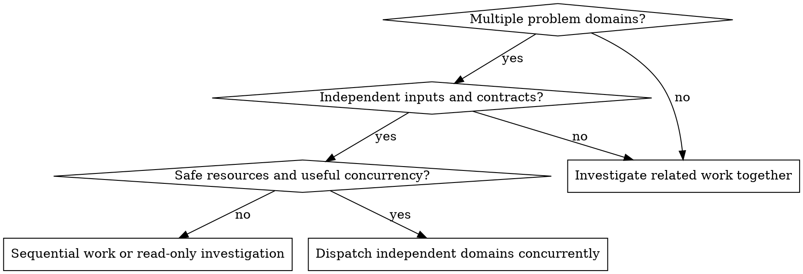

# Dispatching Parallel Agents

## Purpose

Dispatch one agent per independent problem domain and let them investigate or
fix it concurrently. The coordinator integrates their results and retains
responsibility for the whole work. This skill does not turn a sequential
implementation plan into parallel implementation tasks; use
[subagent-driven-development](../subagent-driven-development/SKILL.md) for that
skill's sequential implementation and review cycle.

Give each agent isolated task context: the goal, relevant evidence, interfaces,
constraints, and artifact references it needs. Do not pass accumulated session
history. Isolation does not mean withholding a dependency the task needs.

## Decide Whether Work Is Independent

Useful candidates include unrelated failures in different subsystems or
separate investigations whose results can be evaluated independently. Different
test files alone do not establish independence: failures may share one cause.

Before dispatch, check:

- **Purpose and size:** Each assignment has a meaningful outcome. Splitting
  should save useful investigation time after coordination and integration
  costs; agent availability is not a reason to create more tasks.
- **Inputs and dependencies:** Required inputs already exist, and no assignment
  needs another concurrent assignment's unfinished output or decision.
- **Interfaces and invariants:** Changes can preserve agreed API behavior,
  formats, and shared rules without coordinating their implementation live.
- **Mutable resources:** Writers have separate authorized surfaces and execution
  state. Check Git index, HEAD and branch state, generated outputs, caches,
  databases, ports, and test services as well as source files.

Read-only investigations may share stable inputs. For concurrent writers, use
the applicable Git workspace workflow to assign isolated checkouts when Git
state or outputs would conflict. Separate checkouts do not remove semantic
dependencies or isolate shared external services. If safe isolation is not
available, parallelize investigation only or execute the affected work
sequentially.

## Prepare Briefs and Reports

Use [writing-agent-handoffs](../writing-agent-handoffs/SKILL.md) and its existing
[brief](../writing-agent-handoffs/templates/brief.md) and
[report](../writing-agent-handoffs/templates/report.md) templates. Reuse the
project's or current workflow's paths and records; otherwise use that skill's
`.kryptonite/work/<work-id>/` defaults. Do not create a competing spec or
contract document for each agent.

Each brief identifies the request, brief revision, assignee, current owner,
role, and report destination, and includes:

- The original goal or symptom, governing spec/plan revision and applicable
  requirement IDs. Passing a failing test is evidence, not permission to
  replace the requested behavior with whatever passes.
- The bounded investigation or fix, required inputs and their snapshots,
  assumptions that must hold before work starts, and relevant interfaces.
- Observable completion criteria, required outcomes, and shared invariants
  that must still hold after the work. Put these in the template's existing
  inputs, constraints, and completion sections.
- Permitted writes and decisions, excluded work, verification scope, and what
  dependency or missing input should cause a report before continuing.
- Expected artifacts and criterion-linked evidence, including actual checked
  revisions, commands/results, remaining work, and integration requirements.

Use the predefined roles where applicable: `researcher` for investigation,
`implementer` for fixes, and `coordinator` for integration. A role does not
grant authority. A brief/report retains the requester's responsibility;
changing a worker does not transfer it. Use a handoff only when the owner
transfers continuation of the named scope; no acknowledgement is required.

## Dispatch and Monitor

Start independent assignments through the host's actual concurrent execution
mechanism, within project and host limits. Multiple calls in one message do
not by themselves guarantee concurrent execution. Choose concurrency and
models according to task complexity, evidence needs, and coordination cost;
do not fill every available slot automatically.

Give each worker its brief path, work root, necessary context references, and
report destination. Workers return a compact status and report reference;
the full report preserves evidence and material failed attempts. Handle
`DONE`, `DONE_WITH_CONCERNS`, `NEEDS_CONTEXT`, and `BLOCKED` as claims requiring
owner evaluation, not automatic integration approvals.

**If independence breaks:** A worker reports the affected interface, invariant,
resource, or unfinished dependency and pauses the affected activity before
making conflicting changes. The current owner decides whether to supply
context, repartition, isolate resources, or sequence the coupled work. Update
the affected briefs and record the decision; unrelated assignments can continue
while their independence remains valid. Do not silently expand a worker's scope.

**If another attempt is needed:** Follow project limits. Identify what changed
in the hypothesis, context, inputs, or diagnostics before retrying. A test-count
plateau alone does not establish no progress. If no meaningful next attempt is
available, return the missing input or blocker instead of repeating the same
assignment unchanged.

## Evaluate and Integrate

1. Match each report to its request, brief revision, assignee, and actual
   artifact snapshot. Resolve its recipient from the current ownership record
   if the owner changed; preserve the original requester and actual author.
2. Compare results with the original goal and observable criteria. Inspect
   changes and unresolved concerns; retain a useful partial result without
   calling an unmet or unverified criterion complete.
3. Check both write conflicts and semantic interaction: interfaces, shared
   invariants, and assumptions that another result may invalidate. A clean
   merge and individually passing tests are insufficient combined evidence.
4. Integrate the authorized changes and verify the actual integrated state:
   reproduce the original symptoms, check the affected cross-component
   contracts, and run the relevant regression checks and project-required
   suite. Record the tested target; earlier worker runs apply to their recorded
   snapshots, not automatically to the combined result.
5. Use [requesting-code-review](../requesting-code-review/SKILL.md) at the review
   points required by the change and project. Supply the real baseline-to-target
   range, governing requirements, and evidence. Evaluate feedback through
   [receiving-code-review](../receiving-code-review/SKILL.md) before assigning
   fixes; valid unresolved Critical/Important findings prevent completion.

Parallel dispatch does not add SDD's mandatory per-task review loop to every
investigation. Keep the enclosing workflow's review and completion gates.

## Recover Without Repeating Work

After interrupted execution or a late report, inspect the recorded assignment,
current owner, artifact state, and brief/spec revisions before dispatching again.
Reconcile an unknown tool outcome before repeating a mutation. A request ID
helps identify intent but does not guarantee exactly-once execution.

An older report may retain useful evidence; determine which criteria and
assumptions remain valid instead of treating it as current merely because its
status is `DONE`, or discarding all of it merely because a revision changed.
Preserve material attempts and pending requests through worker replacement or
ownership transfer.

For development work, use
[developing-with-specs](../developing-with-specs/SKILL.md) for durable
documentation and spec retention, and
[writing-agent-handoffs](../writing-agent-handoffs/SKILL.md) for communication
records. Route requested commit preparation through
[using-kryptonite](../using-kryptonite/SKILL.md). Parallel dispatch owns
independent assignments and result integration. Returning reports does not
authorize disposal of pending records or cleanup of other work.

## Example

Two failures appear independent: a parser rejects a supported format and a
background job fails to publish an update. Assign separate briefs with stable
inputs and isolated write resources. If the job agent discovers that its
payload uses the parser's changing format, it reports that dependency before
changing the format itself. Sequence only the coupled fix. After integrating,
verify that the supported input still reaches the published update, even if
both original unit tests passed independently.
