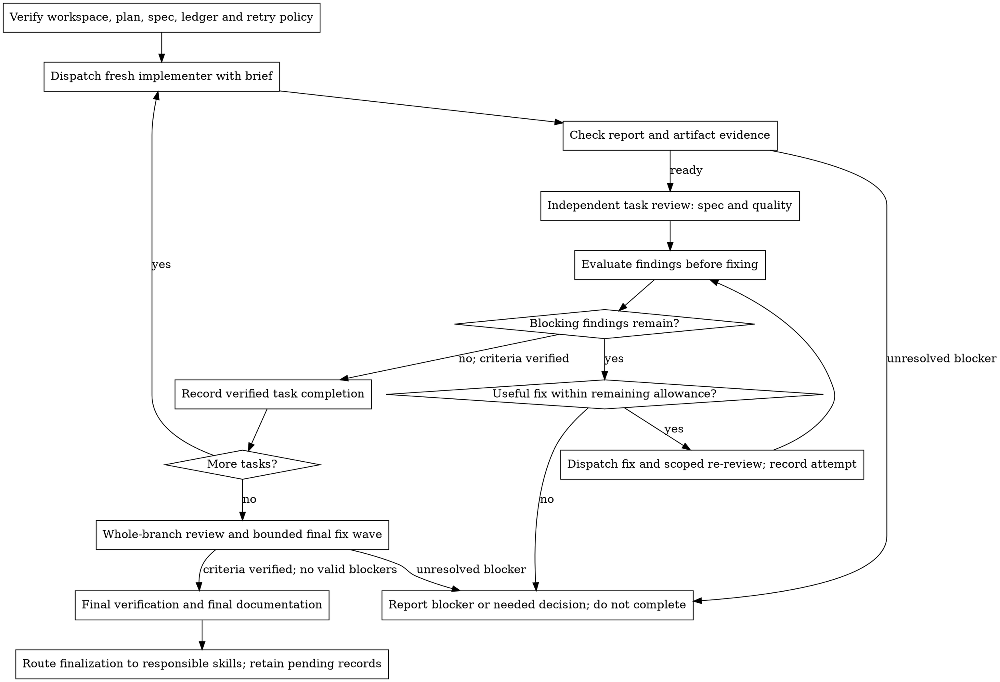

# Subagent-Driven Development

Execute a plan with a fresh implementer for each meaningful task, a combined
spec-compliance and quality review after each task, scoped reviews of fixes,
and a broad whole-branch review at the end. Implementation tasks run
sequentially; never dispatch multiple implementation subagents concurrently.

Give workers isolated task context rather than accumulated session history.
Provide the relevant purpose, interfaces, constraints, and artifact references;
do not omit a dependency just to keep the prompt short. The controller retains
responsibility and coordinates rather than making unreviewed inline fixes.

Execute the authorized plan continuously without asking whether to continue
between tasks. Give concise updates on material findings and blockers. Stop
dependent work when a missing decision or valid blocking issue prevents it.

## When to Use

Use this when a plan has meaningful, bounded tasks that fresh implementers can
execute with supplied context and completed prerequisite outputs. Check task
boundaries through purpose, interfaces, and dependencies, not file count or
arbitrary time slices. Resolve tightly coupled or contradictory tasks before
dispatch instead of silently rewriting the plan.

[executing-plans](../executing-plans/SKILL.md) supports direct plan execution in
the current or a successor session. This skill adds sequential delegated
implementation and task-level review. It does not replace
[dispatching-parallel-agents](../dispatching-parallel-agents/SKILL.md), which
handles independent problem domains concurrently.

## Setup and Recovery

Use the applicable Git workspace workflow to verify or create a suitable
checkout within existing authorization. Respect project/user branch and commit
instructions; this skill does not grant permission for Git or external actions.

Read the plan once, locate its governing working spec through
[developing-with-specs](../developing-with-specs/SKILL.md), and note purpose,
requirement IDs, revisions, global constraints, prerequisites, and task order.
Identify conflicting requirements or mandated behavior that appears defective.
Resolve factual questions from existing authority; batch unresolved material
decisions for the owner or user before affected implementation. Do not invent
a new spec per worker or rationalize a choice only after implementing it.
Workers return proposed requirement or decision changes in reports; the current
owner consolidates the shared spec and records material choices before dependent
implementation, following developing-with-specs.

Preserve existing SDD artifact locations. Without a project-specified override,
run this skill's `scripts/sdd-workspace PLAN_FILE`: it prints
`<repo-root>/.kryptonite/sdd/<plan-basename>/`. The directory holds the plan's
ledger, briefs, reports, and review packages. Configured destinations can be
passed explicitly to the helpers that accept `OUTFILE`; do not migrate existing
records merely to adopt the communication templates.

The ledger is `<workspace>/progress.md`, beginning with
`# SDD ledger — plan: <plan file path>`. Record the full plan identity and
revision, governing spec revision, starting branch baseline, current owner,
retry policy, and task/request identities. A different plan with the same
basename can collide with the helper's default directory: leave its records
untouched and choose a distinct authorized workspace with explicit output paths.
The old flat ledger and other plans' records are not this plan's progress.

Record each dispatch before execution: assignee, request/brief revision,
baseline, intended artifacts, report destination, phase, and fix round or wave
if applicable. Record outcomes, actual targets, evidence, findings and their
dispositions, consumed attempts, and the next needed action. Keep history;
todos and conversation memory alone are insufficient recovery records.

On resumption, inspect the ledger together with actual Git/artifact state:

- A `Task <N>: complete` entry prevents redispatch only when its identity,
  requirements, artifact lineage, and evidence still establish that completion.
  Later changes can require scoped revalidation without repeating the task.
- An interrupted dispatch has an unknown outcome until reconciled. Inspect
  its worker state, commits, uncommitted changes, reports, and side effects
  before repeating a mutation or starting the next fix round. Resume or record
  the already dispatched round; do not silently charge or repeat it twice.
- Match late reports to the original request, brief revision, author, target,
  and current owner. Reuse evidence whose assumptions remain valid; identify
  superseded or unverified claims instead of accepting `DONE` at face value.
- An assignee replacement leaves ownership unchanged. If the owner transfers
  continuation, use a handoff without requiring acknowledgement; preserve open
  requests, routing, evidence, policy, and consumed rounds for the successor.
- If scratch records are lost, reconstruct from Git and available artifacts;
  Git alone cannot restore uncommitted work, verification logs, or decisions.

## Policy and Model Selection

Project instructions govern retry limits. Otherwise use at most **five fix
rounds per task** and **one final-review fix wave**. These are maxima, not a
requirement to exhaust attempts. Record the chosen policy and consumed rounds;
resumption, worker replacement, or handoff does not reset them. A tool retry
within one assignment is not a new reasoning round, and still requires outcome
reconciliation when a side effect may already have occurred.

Follow project and host model preferences. Choose capacity from the judgment,
context, risk, and verification needed for the role; file count or token price
alone is insufficient. A broad final review needs cross-task reasoning.
For a stuck worker, inspect missing context, scope, dependencies, and failed
hypotheses before assuming a more capable model solves the cause. Use a fresh
or more capable implementer where justified and permitted; if no alternate
model is available, improve context or report the remaining blocker.

## 1. Dispatch the Implementer

Record the task's `BASE` before dispatch (`git rev-parse HEAD` for committed
work) and the exact working-state baseline if changes are uncommitted.

For a new task brief, run `scripts/task-brief PLAN_FILE N [OUTFILE]`. It extracts
the full `Task N` text and reports `wrote <path>: <line count> lines`; use that
path. Do not regenerate a live enriched brief blindly on resume: the helper
overwrites its output.

Apply [writing-agent-handoffs](../writing-agent-handoffs/SKILL.md) and the
existing [brief template](../writing-agent-handoffs/templates/brief.md) to this
same artifact, retaining the extracted task text verbatim and adding:

- Request and brief revision, requester/current owner, assignee as `implementer`,
  work root, permitted writes/decisions, and report destination.
- The original purpose and relevant spec/plan revisions and requirement IDs.
  The governing spec remains authoritative; the brief is the bounded assignment.
- Required input snapshots and completed prerequisites, observable outcomes,
  shared interfaces/invariants, and conditions requiring missing-context or
  dependency escalation. Use the existing inputs/constraints/criteria sections.
- Any binding global constraints and decisions not contained in the task text,
  required verification, and downstream work that depends on this result.

Keep exact task values in the brief instead of conflicting prompt copies.
For material amendments, record a new brief revision and preserve the earlier
basis or revision history so late results can be interpreted correctly.
The dispatch contains the brief/report paths, work root, a short explanation
of where the task fits, and necessary context references. The worker may read
referenced spec or dependency sections; it need not ingest the whole plan.

Keep the established `task-N-report.md` beside `task-N-brief.md`. Use the existing
[report template](../writing-agent-handoffs/templates/report.md); successive
returns in the same file append separately identified reports with request,
brief revision, actual author/recorder, target snapshot, and evidence. Preserve
earlier reports. Review and fix assignments have their own request identities
and destinations recorded in the ledger, even when they reuse relevant inputs.

Record the dispatched agent's identity. The default task fix policy resumes
that implementer for rounds 1–3 and uses a fresh implementer for rounds 4–5,
with capability adjusted when justified. A new plan task always starts with a
fresh implementer. Template: [implementer-prompt.md](implementer-prompt.md).

## 2. Evaluate the Report

Verify assignment identity, artifact state, criterion outcomes, and evidence.
`DONE` is a completion claim; `DONE_WITH_CONCERNS` requires evaluating its
concerns. Neither bypasses independent review. A failed required criterion or
missing blocking input is incomplete, regardless of the status label.

For `NEEDS_CONTEXT` or `BLOCKED`, inspect what was tried and what input, decision,
or diagnosis would change the next attempt. Supply available context or resolve
a bounded decision within authority. If an unexpected dependency couples tasks,
record it and resolve the affected ordering or scope with the governing plan's
owner; do not silently expand the worker's task. Ask the user only for a
necessary unresolved choice or authority. Do not repeat an unchanged assignment
or proceed with dependent work while its prerequisite remains blocked.

## 3. Review the Task Independently

Dispatch a reviewer distinct from the producer. Use
[requesting-code-review](../requesting-code-review/SKILL.md) with the task-scoped
[task-reviewer-prompt.md](task-reviewer-prompt.md). Self-review does not replace
the required **spec-compliance and task-quality verdicts**.

Generate the review package with
`scripts/review-package PLAN_FILE BASE HEAD [OUTFILE]`. The helper reports
`wrote <path>: ...`; pass the actual path. Use the recorded pre-task baseline
and actual target, never `HEAD~1` for a multi-commit task. The package includes
all commits and the net diff in that range. It covers committed changes only;
if commits are deferred, provide an equivalent versioned package including
uncommitted and new-file changes and identify the exact reviewed snapshot.
Do not commit merely to make the helper usable.

The review brief supplies governing purpose/criteria, binding global constraints,
producer report, package, exact target, and permitted reporting surface. The
review is read-only on the implementation checkout; a reviewer may return its
report for an authorized recorder, preserving actual authorship. Completing
the review assignment is distinct from approving the implementation.

Judge actual changes against the original requested outcome, including
necessary supporting requirements. Do not frame producer rationale or plan
authorship as a reason to suppress findings. Inspect additional context for
a named risk or an unverifiable requirement instead of crawling without a
purpose. Resolve `Cannot verify from diff` criteria before task completion.

Reuse existing check evidence when it covers the same code, environment, and
question. When evidence is missing, mismatched, contradictory, or a new risk
requires reproduction, allow the smallest adequate independent check. Broader
checks can be justified by a cross-component or concurrency risk, within
resource/authorization boundaries and without mutating the implementation
checkout. Arrange an isolated verification environment or owner-run check if
needed; do not ban necessary verification or rerun suites by ritual.

## 4. Evaluate Feedback and Fix Within the Limit

Apply [receiving-code-review](../receiving-code-review/SKILL.md) **before each
fix assignment**. Check each finding against requirements, actual artifacts,
and project context. Clarify unclear feedback; record supported acceptance,
reasoned rejection, or unresolved evidence needs with stable finding IDs.
A genuine conflict with a governing user decision requires resolution by the
appropriate owner or user. Do not wait until the attempt cap to evaluate
feedback, silently discard it, or downgrade a valid issue just to end the loop.

Valid spec failures and Critical/Important issues enter the fix loop. Minor
issues can be recorded for final-review triage. Rejected findings carry their
evidence and rationale to final review; rejection is not deferred acceptance.

Before another round, identify its useful next hypothesis, changed context,
dependency resolution, or diagnostic step. A test-count plateau alone does not
establish no progress. If no useful next attempt is possible, investigate or
report the missing input/blocker before exhausting the allowance.

For each allowed round:

1. Record round `R/<limit>`, its fix request and brief revision, assignee,
   `FIX_BASE` (the prior reviewed target), scope, and `STARTED` phase before
   dispatch. Preserve the consumed round if execution is interrupted.
2. Delegate the evaluated findings with their IDs and evidence. Keep changes
   bounded; the controller does not make inline fixes. The implementer appends
   a report with actual changes, snapshot, criterion results, covering check
   commands/results, unresolved findings, and new diagnostic information.
3. Package the full fix range or working snapshot and dispatch
   [re-review-prompt.md](re-review-prompt.md). Check prior findings and
   regressions caused by the fix. Reuse valid evidence or obtain justified
   reproduction; the fix report alone does not establish that a finding closed.
4. Record outcomes and finding dispositions, then evaluate any remaining
   feedback before another assignment. Out-of-scope observations go to owner
   triage; a valid blocking issue does not become Minor because it was found
   outside the fix diff.

At the limit, stop dispatching further fixes under that policy. A valid
unresolved Critical/Important finding, unmet binding criterion, or unresolved
blocking verification gap leaves the task **BLOCKED**, even if nothing
downstream currently uses it. Report the findings, evidence, attempts, and
needed decision. An authorized scope or policy change must be explicit and
recorded; reaching the limit does not grant a waiver.

## 5. Complete the Task

Only after binding criteria are verified, both review verdicts have been
evaluated and their findings resolved or rejected with supporting evidence,
and no valid blocking finding remains, append:
`Task <N>: complete (target <revision-or-snapshot>, review <report-id>)`.
Keep the original verdicts and the owner's supported dispositions alongside
the baseline, evidence, rejected findings, and deferred minors in the ledger.
A reasoned rejection need not consume a fix round when no change is needed.
Mark the todo complete and move to the next task; do not redispatch
completed tasks after resumption without a material reason.

## Final Review and Fix Wave

After all tasks, review the entire change from the recorded branch/work
baseline to the actual target, not merely the last task's diff. Use the package
helper for committed ranges, or a versioned equivalent covering the full
working state. Provide the governing spec/plan, producer evidence, and ledger
entries for deferred/rejected findings to
[requesting-code-review's reviewer](../requesting-code-review/code-reviewer.md).
Include original-goal and cross-task interface/invariant checks on the actual
integrated state. Individual task checks and a clean merge do not establish
combined correctness.

Evaluate final feedback before fixing. Under the default policy, dispatch
**one fix implementer with the accepted blocking findings together**, then
one scoped re-review of that wave. Project policy can specify another limit;
record the wave before dispatch and preserve consumption on resume or handoff.
Minor findings can be triaged without inventing a mandatory fix wave. Unresolved
valid blockers or verification gaps prevent final completion; do not park them
as passed or start an unrecorded second wave.

## Finish and Record Retention

Use [verification-before-completion](../verification-before-completion/SKILL.md)
to check final artifacts against the working spec. Use
[developing-with-specs](../developing-with-specs/SKILL.md) for final durable
documentation and spec retention, and
[writing-agent-handoffs](../writing-agent-handoffs/SKILL.md) for communication
records. Route requested commit preparation through
[using-kryptonite](../using-kryptonite/SKILL.md).

SDD owns its task/final review scheduling and fix limits; it does not own common
commit timing. Renew affected evidence when preparation changes a reviewed
target, within those same gates and limits. Unresolved blockers do not become
passed because the allowance was exhausted, and preparation does not restart it.

Preserve the existing plan workspace and ledger while stages, requests, or
remaining work are pending. Dispose of only completed owned records after
their necessary information is preserved and retention needs are met;
Git resource cleanup follows the project's Git procedure separately. A task
report or final review does not authorize committing, integration, publication,
or deletion.
