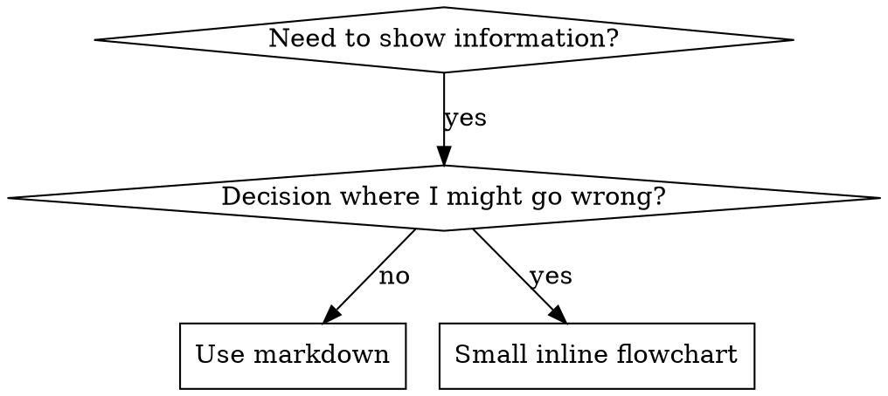

# Writing Skills

## Overview

A skill should improve a future agent's decisions in a recurring situation.
Define the intended outcome, write focused guidance, and validate the changed
meaning in proportion to its consequences.

**Personal skills live in your Codex skills directory.** This plugin's skills
live in its `skills/` directory. Read
[codex-tools.md](../using-kryptonite/references/codex-tools.md) when authoring
or validation depends on the current harness's tools or workspace.

Use existing evidence when available. A baseline comparison can help diagnose
a failure or evaluate a proposed instruction; a failing baseline is not a
prerequisite for requested guidance. The proportional check-selection principles
in [test-driven-development](../test-driven-development/SKILL.md) can inform
validation without making every documentation edit a RED-GREEN exercise.

## What is a Skill?

A **skill** is reusable guidance for a technique, decision pattern, or reference.
Its instructions should help future agents make the intended decisions.

**Skills are:** Reusable techniques, patterns, tools, reference guides

**Skills are NOT:** Narratives about how you solved a problem once

## Define the Skill's Responsibility

Before creating or changing a skill, identify:
- The recurring request or observable condition that triggers it.
- Cases where it should not apply, especially near neighboring skills.
- The independent decision it helps an agent make and the useful outcome.
- Its inputs, constraints, and responsibility boundaries.
- Existing skills or project instructions that already own part of the work.

Reuse or reference an existing owner when it already covers the decision.
Put detailed procedures in the responsible skill rather than duplicating them.
Use the existing task record to capture consequential decisions; no separate
authoring ledger is required.

## When to Create a Skill

**Create when:**
- Technique wasn't intuitively obvious to you
- You'd reference this again across projects
- Pattern applies broadly (not project-specific)
- Others would benefit

**Don't create for:**
- One-off solutions
- Standard practices well-documented elsewhere
- Project-specific conventions (put in your instructions file)
- Mechanical constraints (if it's enforceable with regex/validation, automate it—save documentation for judgment calls)

## Skill Types

### Technique
Concrete method with steps to follow (condition-based-waiting, root-cause-tracing)

### Pattern
Way of thinking about problems (flatten-with-flags, test-invariants)

### Reference
API docs, syntax guides, tool documentation (office docs)

## Directory Structure


```
skills/
  skill-name/
    SKILL.md              # Main reference (required)
    supporting-file.*     # Only if needed
```

This plugin keeps its skills in one searchable directory. Use the target
runtime's supported layout for skills maintained elsewhere.

**Separate files for:**
1. **Conditional or substantial reference** - detail needed only for some tasks
2. **Reusable resources** - scripts, utilities, or workflow templates

**Keep inline:**
- Purpose, essential decisions, and constraints
- Short examples needed to understand those decisions
- Links explaining when supporting resources should be read or used

## SKILL.md Structure

**Frontmatter (YAML):**
- Include required `name` and `description` fields; preserve supported optional metadata.
- Use the target runtime's validator for supported fields and limits.
- `name`: Use lowercase letters, numbers, and hyphens.
- `description`: Identify the capability and concrete conditions for using it.
  - Start with "Use when..." when that makes the trigger clear.
  - Include relevant symptoms, situations, and boundaries.
  - Keep detailed steps in the body so metadata does not become a substitute workflow.

```markdown
---
name: skill-name-with-hyphens
description: Use when [specific triggering conditions and symptoms]
---

# Skill Name

## Overview
What is this? Core principle in 1-2 sentences.

## When to Use
[Small inline flowchart IF decision non-obvious]

Bullet list with SYMPTOMS and use cases
When NOT to use

## Core Pattern (for techniques/patterns)
Before/after code comparison

## Quick Reference
Table or bullets for scanning common operations

## Implementation
Inline code for simple patterns
Link to file for heavy reference or reusable tools

## Common Mistakes
What goes wrong + fixes

## Real-World Impact (optional)
Concrete results
```


## Skill Discovery Optimization (SDO)

**Critical for discovery:** Future agents need to FIND your skill

### 1. Rich Description Field

**Purpose:** Your agent reads the description to decide which skills to load for a given task. Make it answer: "Should I read this skill right now?"

**Format:** Start with "Use when..." to focus on triggering conditions

**Focus the description on discovery.**

Identify the capability, triggering conditions, and useful exclusions.
Put detailed procedures in the skill body, where the agent can read the
complete decisions and constraints rather than acting on a metadata summary.

```yaml
# ❌ BAD: Summarizes workflow - agents may follow this instead of reading skill
description: Use when executing plans - dispatches subagent per task with code review between tasks

# ❌ BAD: Too much process detail
description: Use for TDD - write test first, watch it fail, write minimal code, refactor

# ✅ GOOD: Just triggering conditions, no workflow summary
description: Use when executing implementation plans with independent tasks in the current session

# ✅ GOOD: Triggering conditions only
description: Use when implementing features, fixing defects, or refactoring and selecting meaningful regression checks
```

**Content:**
- Use concrete triggers, symptoms, and situations that signal this skill applies
- Describe the *problem* (race conditions, inconsistent behavior) not *language-specific symptoms* (setTimeout, sleep)
- Keep triggers technology-agnostic unless the skill itself is technology-specific
- If skill is technology-specific, make that explicit in the trigger
- Write in third person (injected into system prompt)
- Keep detailed workflow steps in the body

```yaml
# ❌ BAD: Too abstract, vague, doesn't include when to use
description: For async testing

# ❌ BAD: First person
description: I can help you with async tests when they're flaky

# ❌ BAD: Mentions technology but skill isn't specific to it
description: Use when tests use setTimeout/sleep and are flaky

# ✅ GOOD: Starts with "Use when", describes problem, no workflow
description: Use when tests have race conditions, timing dependencies, or pass/fail inconsistently

# ✅ GOOD: Technology-specific skill with explicit trigger
description: Use when using React Router and handling authentication redirects
```

### 2. Keyword Coverage

Use words an agent would search for:
- Error messages: "Hook timed out", "ENOTEMPTY", "race condition"
- Symptoms: "flaky", "hanging", "zombie", "pollution"
- Synonyms: "timeout/hang/freeze", "cleanup/teardown/afterEach"
- Tools: Actual commands, library names, file types

### 3. Descriptive Naming

**Use active voice, verb-first:**
- ✅ `creating-skills` not `skill-creation`
- ✅ `condition-based-waiting` not `async-test-helpers`

### 4. Token Efficiency (Critical)

Keep frequently used entrypoints concise so relevant guidance is easy to find.
Move substantial conditional detail to supporting resources when that improves
use. Preserve essential decisions and boundaries; a word count is a writing
aid rather than an acceptance gate.

**Techniques:**

**Move details to tool help:**
```bash
# ❌ BAD: Document all flags in SKILL.md
search-conversations supports --text, --both, --after DATE, --before DATE, --limit N

# ✅ GOOD: Reference --help
search-conversations supports multiple modes and filters. Run --help for details.
```

**Use cross-references:**
```markdown
# ❌ BAD: Repeat workflow details
When searching, dispatch subagent with template...
[20 lines of repeated instructions]

# ✅ GOOD: Reference other skill
When independent tasks warrant parallel work, use the available
[dispatching-parallel-agents](../dispatching-parallel-agents/SKILL.md) workflow.
```

**Compress examples:**
```markdown
# ❌ BAD: Verbose example (42 words)
your human partner: "How did we handle authentication errors in React Router before?"
You: I'll search past conversations for React Router authentication patterns.
[Dispatch subagent with search query: "React Router authentication error handling 401"]

# ✅ GOOD: Minimal example (20 words)
Partner: "How did we handle auth errors in React Router?"
You: Searching...
[Dispatch subagent → synthesis]
```

**Eliminate redundancy:**
- Don't repeat what's in cross-referenced skills
- Don't explain what's obvious from command
- Don't include multiple examples of same pattern

**Review:** Check whether each section helps the current decision or belongs in
a conditional reference. Length alone does not establish clarity or correctness.

**Name by what you DO or core insight:**
- ✅ `condition-based-waiting` > `async-test-helpers`
- ✅ `using-skills` not `skill-usage`
- ✅ `flatten-with-flags` > `data-structure-refactoring`
- ✅ `root-cause-tracing` > `debugging-techniques`

**Gerunds (-ing) work well for processes:**
- `creating-skills`, `testing-skills`, `debugging-with-logs`
- Active, describes the action you're taking

### 5. Cross-Referencing Other Skills

Link to the available skill or supporting file and explain when it is needed:

```markdown
When an unexpected failure needs investigation, use
[systematic-debugging](../systematic-debugging/SKILL.md).
```

Mark a dependency as required only when the task genuinely depends on it.
An optional reference is not a prerequisite. Read or execute supporting files
when the current task needs their detail, using the target runtime's supported
reference mechanisms.

## Flowchart Usage



**Use flowcharts ONLY for:**
- Non-obvious decision points
- Process loops where you might stop too early
- "When to use A vs B" decisions

**Never use flowcharts for:**
- Reference material → Tables, lists
- Code examples → Markdown blocks
- Linear instructions → Numbered lists
- Labels without semantic meaning (step1, helper2)

See [graphviz-conventions.dot](graphviz-conventions.dot) for graphviz style rules.

**Visualizing for your human partner:** Use [render-graphs.js](render-graphs.js)
when rendering a skill's flowcharts to SVG is useful:
```bash
./render-graphs.js ../some-skill           # Each diagram separately
./render-graphs.js ../some-skill --combine # All diagrams in one SVG
```

## Code Examples

**One excellent example beats many mediocre ones**

Choose most relevant language:
- Testing techniques → TypeScript/JavaScript
- System debugging → Shell/Python
- Data processing → Python

**Good example:**
- Complete and runnable
- Well-commented explaining WHY
- From real scenario
- Shows pattern clearly
- Ready to adapt (not generic template)

**Don't:**
- Implement in 5+ languages
- Leave placeholders in an example that must run as written
- Write contrived examples

Workflow templates may use named placeholders when those fields are part of
the intended contract. Keep executable examples complete enough for their purpose.

## File Organization

### Self-Contained Skill
```
defense-in-depth/
  SKILL.md    # Everything inline
```
When: All content fits, no heavy reference needed

### Skill with Reusable Tool
```
condition-based-waiting/
  SKILL.md    # Overview + patterns
  example.ts  # Working helpers to adapt
```
When: Tool is reusable code, not just narrative

### Skill with Heavy Reference
```
pptx/
  SKILL.md       # Overview + workflows
  pptxgenjs.md   # 600 lines API reference
  ooxml.md       # 500 lines XML structure
  scripts/       # Executable tools
```
When: Reference material too large for inline

## Verify Proportionally

Choose validation based on the changed meaning, consequences, and existing
evidence. Inspect the final changed text and use the available metadata
validator and relevant reference checks.

| Change | Relevant validation |
|---|---|
| Wording, formatting, or links with unchanged meaning | Inspect the affected structure, metadata, and references. |
| Trigger, decision, workflow, or responsibility changes | Check realistic application, non-application, and boundary cases against the requirements; use actual agent runs when they would resolve material uncertainty. |
| Important or uncertain behavior, or a demonstrated agent failure | Consider comparative agent runs and pressure scenarios within the available tools, authorization, and resource budget. |
| Executable resources | Run the relevant behavior checks for the changed resource. |

A passing baseline is valid evidence. It may show that an alleged failure was
not reproduced or that guidance preserves existing behavior. Do not manufacture
a failure, reject requested guidance because a control passes, or delete and
restart correct work because validation happened later.

Static checks establish structure; scenario inspection checks intended
decisions; agent runs can provide evidence of actual use. Report these scopes
separately. A validator, keyword match, or agent success message does not prove
general effectiveness.

## Testing Different Skill Types

### Discipline or Responsibility Boundaries

Check that the agent observes the actual boundary under relevant pressures.
Also include a legitimate exception or authorized case so the skill does not
block allowed work. Evaluate the resulting actions and artifacts, not whether
the agent repeats the rule.

### Techniques

Check a realistic application, a meaningful edge case, and any changed steps.
Verify the desired outcome and whether the necessary instructions are available.

### Patterns

Check when the pattern helps and when another approach is appropriate.
Look for over-application as well as missed application.

### References

Check whether the agent can find and correctly use representative information.
Verify reference accuracy against authoritative evidence when the edit changes
facts. A pure reference does not need artificial pressure to create a violation.

## Match the Form to the Decision

Choose wording that makes the intended decision or output observable:

| Problem | Useful form |
|---|---|
| A real correctness or authority boundary is bypassed | A clear boundary, its rationale, and relevant examples. |
| The output has the wrong shape | A positive recipe or contract describing the required parts. |
| A necessary element is omitted | A named field or slot in the relevant template. |
| Behavior depends on context | A condition keyed to an observable predicate. |

Make exceptions explicit through their conditions. Avoid vague qualifications
such as "unless it matters" when the reader needs a concrete decision rule.
Do not assume one wording form always wins: evaluate the form against the
intended behavior and retain essential user and project constraints.

## Make Required Boundaries Clear

Use firm language for an actual requirement. Distinguish it from preferences,
examples, and optional methods.

### State the Condition and Action

An instruction such as "publish after validation" leaves authorization unclear.
A more precise instruction is:

```markdown
Prepare the validated artifact for review. Publish when the current request
or applicable project policy authorizes that action and destination.
Passing validation alone does not authorize publication.
```

### Address Demonstrated Misinterpretations

Record a failure's actual reasoning when useful, then explain the relevant
decision. Add a focused clarification when evidence supports it rather than
listing every imaginable excuse.

Illustrative boundary clarifications:

| Interpretation | Relevant constraint |
|---|---|
| "Preparation includes publication." | The requested outcome and existing authorization determine the scope. |
| "The tool is available." | Capability alone does not authorize an action. |
| "The validator passed." | Structural validity does not establish behavioral correctness or publication authority. |

Update discovery metadata only if the change affects when the skill applies.

## Check Changed Guidance

1. Define success from the task's requirements independently of the proposed wording.
2. Select representative application, non-application, and boundary cases for
   the changed decisions. Reuse relevant existing evidence.
3. Write or revise the smallest guidance that covers the intended decision.
4. Inspect the cases or run a suitable evaluation, distinguishing which method
   was used. Include a prior-version or no-guidance comparison when it helps
   answer the evaluation question.
5. Correct demonstrated gaps and rerun the affected checks. Reuse checks whose
   targets and relevant assumptions remain unchanged.

For detailed agent evaluation, read
[testing-skills-with-subagents.md](testing-skills-with-subagents.md) when actual
comparative or pressure testing is warranted.

### Focused Wording Comparisons

A small experiment can help compare alternative instructions before a broader
agent evaluation:

- Use realistic context and fresh, comparable runs when independence matters.
- Include a prior-version or no-guidance control when measuring improvement;
  accept a passing control rather than treating it as a forbidden result.
- Choose repetitions based on the question, variability, consequences, and
  available budget. There is no universal minimum count.
- Inspect actual decisions and artifacts. Manually review automated flags to
  distinguish mistakes from quotations, template echoes, or valid exceptions.
- Keep conclusions within the sampled tasks, contexts, and configurations.

Read [persuasion-principles.md](persuasion-principles.md) only when that
supplementary writing context helps a demonstrated discipline problem. Its
examples do not substitute for evidence that the changed skill works.

## Anti-Patterns

### ❌ Narrative Example
"In session 2025-10-03, we found empty projectDir caused..."
**Why bad:** Too specific, not reusable

### ❌ Multi-Language Dilution
example-js.js, example-py.py, example-go.go
**Why bad:** Mediocre quality, maintenance burden

### ❌ Code in Flowcharts
```dot
step1 [label="import fs"];
step2 [label="read file"];
```
**Why bad:** Can't copy-paste, hard to read

### ❌ Generic Labels
helper1, helper2, step3, pattern4
**Why bad:** Labels should have semantic meaning

## Finish Authoring

Use this checklist for the parts affected by the change; reuse existing task
tracking instead of creating a todo for every item.

- [ ] The trigger, responsibility, useful outcome, and neighboring owners are clear.
- [ ] Metadata, examples, links, and supporting instructions match the final text.
- [ ] Validation fits the changed meaning and consequences.
- [ ] Observed decisions and artifacts satisfy the selected criteria, or remaining
      gaps are reported.
- [ ] Required constraints are distinguishable from illustrative details and
      optional methods.
- [ ] The result is reviewable, with the changed scope, checks, and limits reported.

Related skill changes can be reviewed together while checking the relevant
criteria for each. Follow the user's and project's instructions for any later
commit, push, publication, or installation; finishing authoring does not
automatically perform those actions.

## Discovery Workflow

How future agents find your skill:

1. **Encounters problem** ("tests are flaky")
2. **Searches skills** (greps descriptions, browses categories)
3. **Finds SKILL** (description matches)
4. **Scans overview** (is this relevant?)
5. **Reads patterns** (quick reference table)
6. **Loads example** (only when implementing)

**Optimize for this flow** - put searchable terms early and often.
